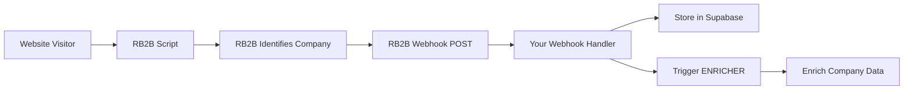

# RB2B Webhook Integration Setup

## Overview
RB2B uses **webhook-only integration** - no API key needed! They push visitor data to your endpoint when someone is identified on your website.

## Setup Steps

### 1. Configure RB2B Webhook
1. Go to [RB2B Dashboard](https://app.rb2b.com/)
2. Navigate to **Integrations** or **Webhooks**
3. Click **Add Webhook** or **Create Integration**
4. Enter your webhook URL:
   ```
   https://your-domain.com/webhooks/rb2b
   ```
5. Copy the **Webhook Secret** (for signature verification)
6. Save the integration

### 2. Add Webhook Secret to .env
```bash
RB2B_WEBHOOK_SECRET=your_webhook_secret_here
```

### 3. Create Supabase Table
Run this SQL in Supabase SQL Editor:

```sql
CREATE TABLE rb2b_visitors (
    id UUID DEFAULT gen_random_uuid() PRIMARY KEY,
    rb2b_visitor_id TEXT UNIQUE,
    company_name TEXT,
    company_domain TEXT,
    company_industry TEXT,
    company_size TEXT,
    company_revenue TEXT,
    company_location TEXT,
    visitor_ip TEXT,
    visitor_country TEXT,
    visitor_city TEXT,
    page_url TEXT,
    referrer TEXT,
    user_agent TEXT,
    session_id TEXT,
    identified_at TIMESTAMPTZ,
    raw_data JSONB,
    created_at TIMESTAMPTZ DEFAULT NOW()
);

-- Index for fast lookups
CREATE INDEX idx_rb2b_company_domain ON rb2b_visitors(company_domain);
CREATE INDEX idx_rb2b_identified_at ON rb2b_visitors(identified_at DESC);
```

### 4. Start Webhook Server

**Development**:
```bash
python webhooks/rb2b_webhook.py
```

**Production** (add to main app):
```python
from webhooks.rb2b_webhook import app as rb2b_app
main_app.mount("/webhooks", rb2b_app)
```

### 5. Test Webhook
```bash
# Health check
curl http://localhost:8000/webhooks/rb2b/health

# Test webhook (mock data)
curl -X POST http://localhost:8000/webhooks/rb2b \
  -H "Content-Type: application/json" \
  -d '{
    "visitor_id": "test_123",
    "company": {
      "name": "Test Corp",
      "domain": "test.com"
    },
    "page_url": "https://chiefaiofficer.com/pricing"
  }'
```

## How It Works



## Webhook Payload Example

```json
{
  "visitor_id": "vis_abc123",
  "session_id": "sess_xyz789",
  "timestamp": "2026-01-22T14:30:00Z",
  "company": {
    "name": "Acme Corp",
    "domain": "acme.com",
    "industry": "Software",
    "employee_count": 250,
    "revenue": "$50M-$100M",
    "location": "San Francisco, CA"
  },
  "ip_address": "192.0.2.1",
  "geo": {
    "country": "United States",
    "city": "San Francisco"
  },
  "page_url": "https://chiefaiofficer.com/pricing",
  "referrer": "https://google.com/search?q=ai+revenue+ops"
}
```

## What Happens Next

1. **Webhook receives data** → Stores in `rb2b_visitors` table
2. **Triggers ENRICHER** → Creates task in `.hive-mind/enrichment/queue/`
3. **ENRICHER processes** → Enriches company with Clay
4. **HUNTER searches** → Finds decision makers on LinkedIn
5. **SEGMENTOR classifies** → Assigns to ICP tier
6. **CRAFTER creates** → Personalized outreach campaign

## Security

- Webhook signature verification using `X-RB2B-Signature` header
- HMAC SHA256 validation
- Rejects invalid signatures

## Monitoring

Check webhook health:
```bash
curl http://your-domain.com/webhooks/rb2b/health
```

View recent visitors in Supabase:
```sql
SELECT 
    company_name,
    company_domain,
    page_url,
    identified_at
FROM rb2b_visitors
ORDER BY identified_at DESC
LIMIT 10;
```
