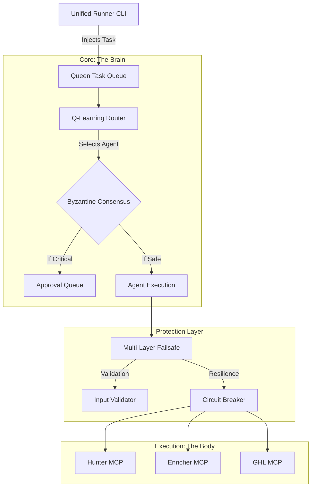

# Wired Architecture: Connecting the Brain to the Body

**Status**: PROPOSED
**Date**: 2026-01-25

## The "Ghost Code" Solution

Our diagnostic found that the sophisticated `core/` (Multi-Layer Failsafes, Unified Queen, Q-Learning) was disconnected from `execution/` (scripts running in production). This architecture document defines how `execution/unified_runner.py` bridges that gap.

## 1. The New Entry Point

`execution/unified_runner.py` becomes the single source of truth for starting the swarm.

### Before (Fragmented)
- `priority_4_parallel_mode.py`: Runs a loop, calls agents directly. No failsafes.
- `revenue_queen_master_orchestrator.py`: Different logic, different reasoning bank.
- `core/unified_queen_orchestrator.py`: theoretically perfect but unused.

### After (Wired)
- **Unified Runner**: Initializes the `UnifiedQueen`.
- **Failsafe Wrapper**: All calls wrapped in `@with_failsafe`.
- **Task Injection**: Runner pushes tasks to `Queen.task_queue`.
- **Execution**: Queen's `_worker_loop` picks up tasks -> Routes via `QLearningRouter`.

## 2. Integrated Data Flow

## 3. Benefits of Wiring
1.  **Resilience**: If `Enricher` API fails, `CircuitBreaker` trips, backing off automatically. The CLI doesn't crash.
2.  **Intelligence**: `QLearningRouter` observes which agent solves "lead_gen" tasks best and updates weights.
3.  **Safety**: `InputValidator` checks lead data *before* it hits the MCPs.
